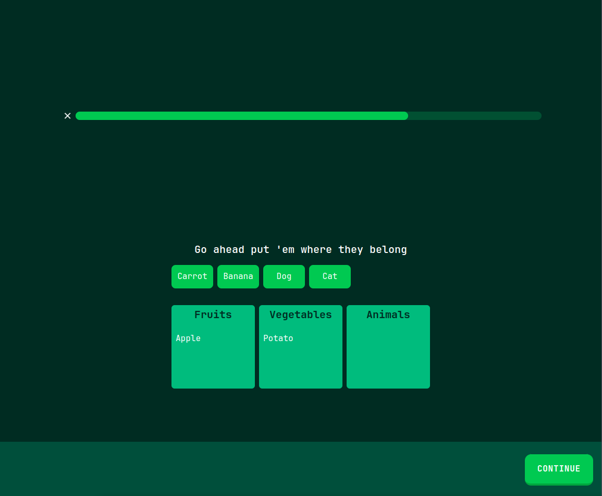
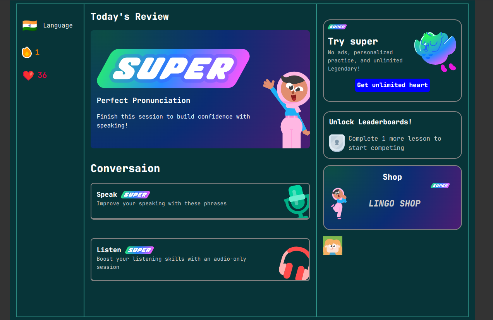

# Lingo

Lingo is a duolingo clone built with MERN stack

# Quiz page

<h3>Wide screen</h3>

<h3>Mobile View</h3>

# Different Types of Quiz

<h2>Objective</h2>

<h2>Match the Grid</h2>

<h2>Match with memory</h2>

<h2>Drag and Drop</h2>

# Review Modal

# Leader Board Page

# Language Page

# Shop to purchase hearts

# Buying hearts

# Super Page 

# Register Page

# 404 Page

